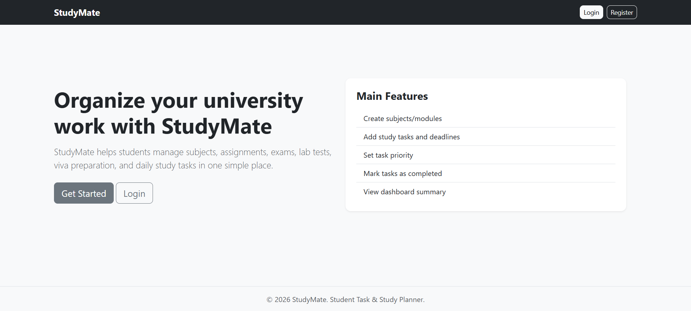
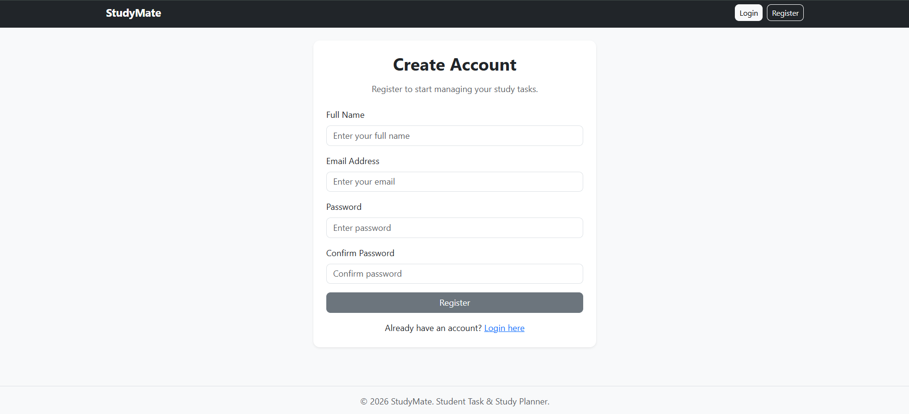
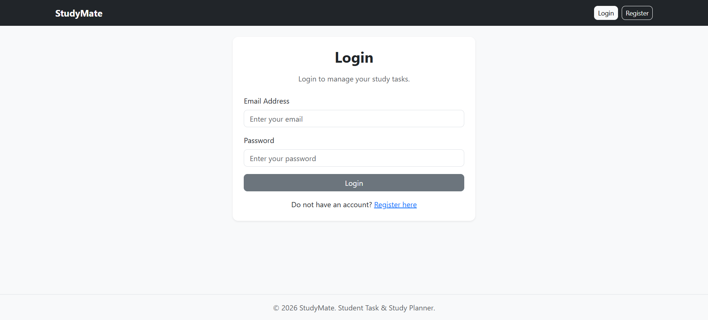
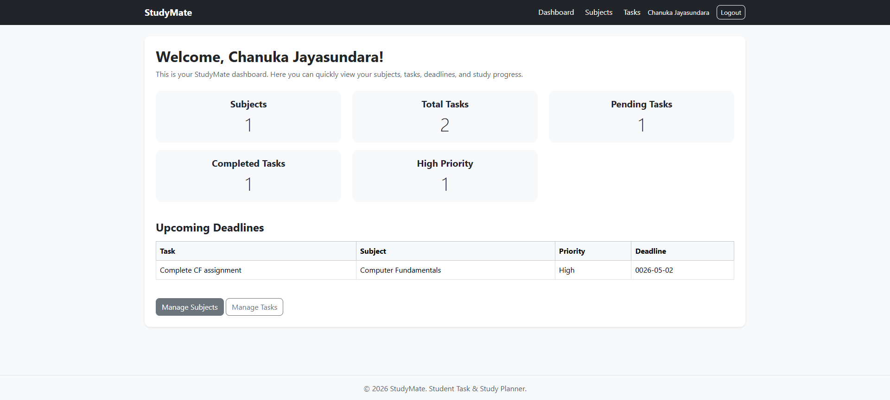
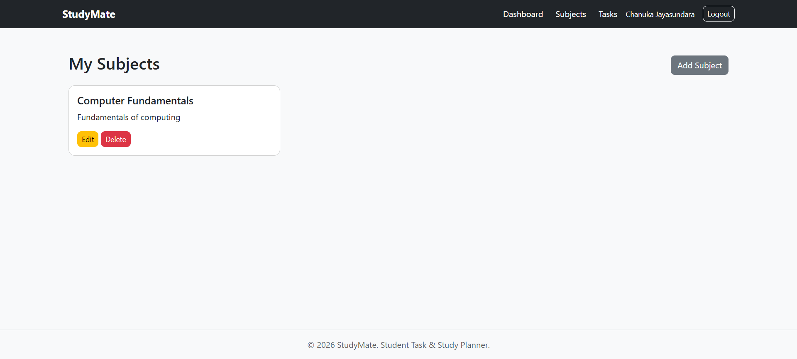
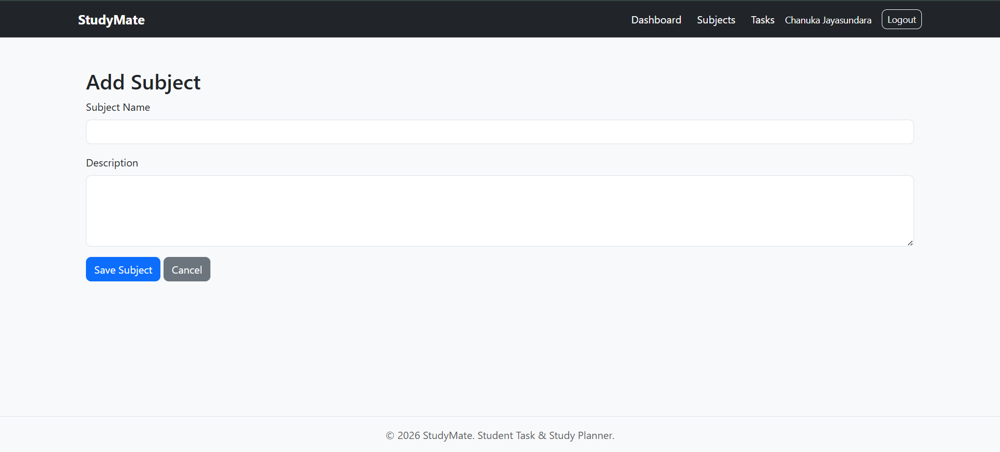
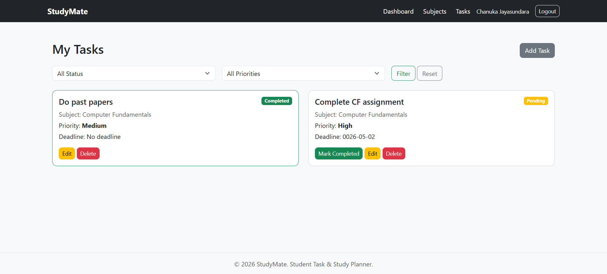
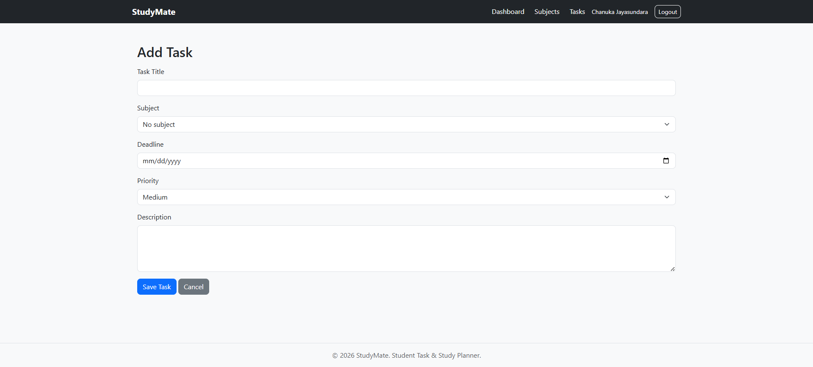

# StudyMate

StudyMate is a student task and study planner web application built as a personal backend development project. The goal of this project is to improve my practical backend skills using PHP, MySQL, sessions, authentication, CRUD operations, and live deployment.

The application helps students organize their university work by managing subjects, study tasks, deadlines, priorities, and task progress.

## Project Status

The main local version of this project is completed.

### Completed

- Initial project folder structure
- MySQL database setup
- Database connection using PDO
- Reusable header and footer
- Homepage
- User registration
- Secure password hashing
- User login
- User logout
- PHP session-based authentication
- Protected dashboard
- Subjects management
- Tasks management
- Edit and delete features
- Mark tasks as completed
- Task filtering by status and priority
- Dashboard statistics
- Upcoming deadlines table
- Basic Bootstrap layout

### Planned / Future Improvements

- Improved UI design
- Demo login account
- Extra dashboard improvements
- Optional future live deployment

## Features

### Authentication Features

- User registration
- User login
- User logout
- Session-based page protection
- Password hashing using PHP `password_hash()`
- Password verification using PHP `password_verify()`

### Subject Management

- Add subjects
- View subjects
- Edit subjects
- Delete subjects

### Task Management

- Add study tasks
- View tasks
- Edit tasks
- Delete tasks
- Mark tasks as completed
- Set task priority
- Set task deadline
- Connect tasks to subjects
- Create tasks without a subject if needed

### Task Filtering

- Filter tasks by status
  - Pending
  - Completed
- Filter tasks by priority
  - Low
  - Medium
  - High
- Reset filters

### Dashboard

- Total subjects count
- Total tasks count
- Pending tasks count
- Completed tasks count
- High priority pending tasks count
- Upcoming deadlines table

## Tech Stack

- PHP
- MySQL
- HTML
- CSS
- Bootstrap
- JavaScript
- PDO
- XAMPP for local development
- GitHub for version control and project sharing

## Project Structure

```text
studymate/
│
├── auth/
│   ├── register.php
│   ├── login.php
│   └── logout.php
│
├── config/
│   ├── app.php
│   └── database.php
│
├── database/
│   └── schema.sql
│
├── includes/
│   ├── auth_check.php
│   ├── header.php
│   └── footer.php
│
├── public/
│   ├── css/
│   │   └── style.css
│   └── js/
│       └── script.js
│
├── subjects/
│   ├── index.php
│   ├── add.php
│   ├── edit.php
│   └── delete.php
│
├── tasks/
│   ├── index.php
│   ├── add.php
│   ├── edit.php
│   ├── delete.php
│   └── complete.php
│
├── dashboard.php
├── index.php
├── .env.example
├── .gitignore
└── README.md
```

## Database

The project uses a MySQL database named:

```text
studymate
```

The database contains the following main tables:

- `users`
- `subjects`
- `tasks`

The database structure is available in:

```text
database/schema.sql
```

## Local Setup

### 1. Clone the repository

```bash
git clone https://github.com/cjdebug/studymate-php.git
```

### 2. Move the project to XAMPP

Place the project folder inside:

```text
C:\xampp\htdocs
```

The path should look like:

```text
C:\xampp\htdocs\studymate
```

### 3. Start XAMPP

Start:

```text
Apache
MySQL
```

### 4. Create the database

Open phpMyAdmin:

```text
http://localhost/phpmyadmin
```

Create a database named:

```text
studymate
```

### 5. Import the database tables

Import or run the SQL file:

```text
database/schema.sql
```

### 6. Open the project

Open the project in your browser:

```text
http://localhost/studymate
```

## Environment Variables

This project includes an `.env.example` file to show the required environment variable names.

Example:

```env
DB_HOST=localhost
DB_PORT=3306
DB_NAME=studymate
DB_USER=root
DB_PASSWORD=
APP_BASE_URL=/studymate
```

For local XAMPP development, the project can use default local database values such as `localhost`, database name `studymate`, username `root`, and an empty password.

For deployment, these values can be changed according to the hosting platform.

The real `.env` file is not uploaded to GitHub because it can contain private database details.

## Security Features Used

This project includes basic backend security practices such as:

- Password hashing instead of storing plain text passwords
- Password verification using `password_verify()`
- PDO prepared statements to reduce SQL injection risk
- Session-based authentication
- Protected page access
- User-specific data access using `user_id`
- `htmlspecialchars()` when displaying user-provided data

## Default Usage Flow

1. Register a new account.
2. Login using the registered account.
3. Add subjects.
4. Add tasks and connect them to subjects if needed.
5. Set task priority and deadline.
6. View tasks from the task management page.
7. Filter tasks by status or priority.
8. Mark tasks as completed.
9. Use the dashboard to view progress and upcoming deadlines.

## Development Note

This project was built as a personal backend development project to improve my practical knowledge of PHP, MySQL, authentication, CRUD operations, and deployment.

During development, I used AI as a learning guide because I could not find a YouTube tutorial that matched the exact type of project and explanation style I needed. I did not use it only to copy and paste code. I used it to get step-by-step guidance, understand the purpose of each file, learn how the code works, and improve the structure of the project.

I reviewed the code, tested each feature locally, fixed issues, added comments where needed, and made sure I understood the main backend concepts used in the project, such as database connection, password hashing, sessions, prepared statements, CRUD operations, filtering, and user authentication.

## Screenshots

### Homepage



### Register Page



### Login Page



### Dashboard



### Subjects Page



### Add Subject Page



### Tasks Page



### Add Task Page



## Live Demo

This project is currently available as a local development project. A live demo is not available at the moment because the project uses PHP and MySQL and requires a hosting platform with database support.

## Demo Account

A demo account is not included because the project is intended to be set up locally using the database schema.

Users can register a new account after importing the database structure.


## Author

**Chanuka Jayasundara**

Personal backend development project.

GitHub: `https://github.com/cjdebug`